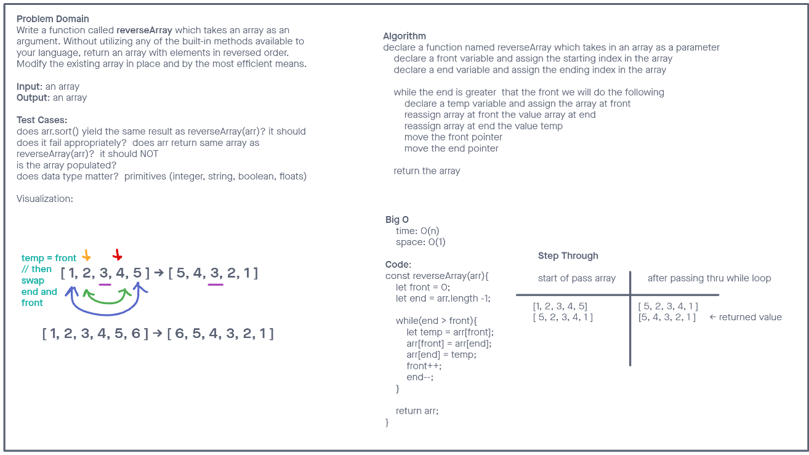

# Reverse an Array

Write a function called `reverseArray` which takes an array as an argument. Without utilizing any of the built-in methods available to your language, return an array with elements in reversed order.

## Whiteboard Process

## Approach & Efficiency

We went with the most efficent approach of doing the swap operation in place. This reduce our space complexity we did not need to create another array to fill and return.

- Big O
  - Time  --> O(n)
  - Space --> O(1)
